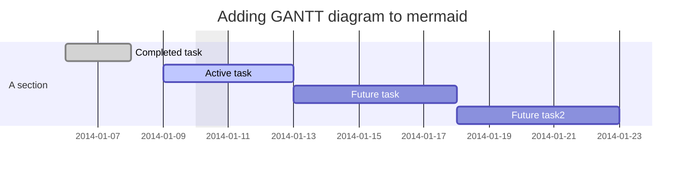

# Examples

The documentation for this library is a working example.

This file for has a diagram using the component and code block.

## Component

```jsx title="Component example"
import { Mermaid } from 'mdx-mermaid/Mermaid'

<Mermaid chart={`sequenceDiagram
    participant Alice
    participant Bob
    Alice->>John: Hello John, how are you?
    loop Healthcheck
        John->>John: Fight against hypochondria
    end
    Note right of John: Rational thoughts <br/>prevail!
    John-->>Alice: Great!
    John->>Bob: How about you?
    Bob-->>John: Jolly good!`} />
```

<Mermaid chart={`sequenceDiagram
    participant Alice
    participant Bob
    Alice->>John: Hello John, how are you?
    loop Healthcheck
        John->>John: Fight against hypochondria
    end
    Note right of John: Rational thoughts <br/>prevail!
    John-->>Alice: Great!
    John->>Bob: How about you?
    Bob-->>John: Jolly good!`} />

## Code block

The component doesn't need to be imported as this will be auto inserted.

````md title="Code block example"

````


## Mermaid Config

Mermaid config can configured through the plugin config:

``` title=docusaurus.config.js
remarkPlugins: [[require('mdx-mermaid'), { mermaid: { theme: 'dark' } }]],
```
