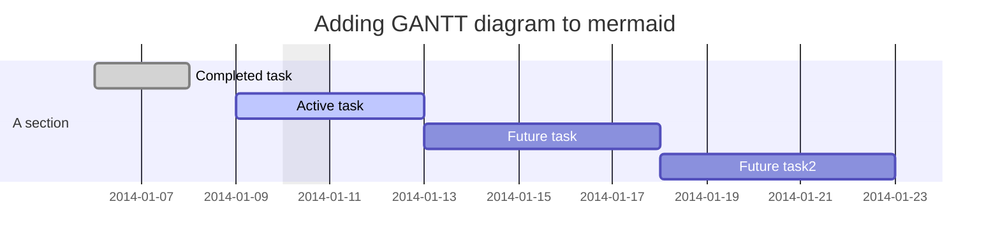

# Examples

The documentation for this library is a working example.

This file, for example, has a diagram using the component and code block.

## Component

```jsx title="Component example"
import { Mermaid } from 'mdx-mermaid/Mermaid'

<Mermaid chart={`sequenceDiagram
    participant Alice
    participant Bob
    Alice->>John: Hello John, how are you?
    loop Healthcheck
        John->>John: Fight against hypochondria
    end
    Note right of John: Rational thoughts <br/>prevail!
    John-->>Alice: Great!
    John->>Bob: How about you?
    Bob-->>John: Jolly good!`} />
```

<Mermaid chart={`sequenceDiagram
    participant Alice
    participant Bob
    Alice->>John: Hello John, how are you?
    loop Healthcheck
        John->>John: Fight against hypochondria
    end
    Note right of John: Rational thoughts <br/>prevail!
    John-->>Alice: Great!
    John->>Bob: How about you?
    Bob-->>John: Jolly good!`} />

## Code block

The component doesn't need to be imported as this will be auto inserted.

````md title="Code block example"

````


## Mermaid Config

Mermaid config can be configured through the plugin config:

```js title=docusaurus.config.js
{
  mermaid: { theme: 'dark' }
}
```

:::caution

When passing config to the `<Mermaid>` component only the first instance should have the config passed to it.
If no config is passed to any component then Mermaid will not initialize.
This is not an issue when using in `.mdx` files as the parser will handle this.
