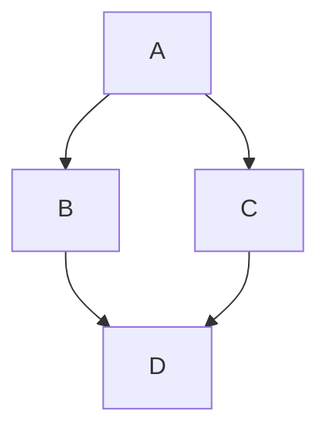

# mdx-mermaid

Plug and play Mermaid in MDX

[][npm]
[][license]
[](https://github.com/sjwall/mdx-mermaid/actions/workflows/build.yml)
[](https://codecov.io/gh/sjwall/mdx-mermaid)
[](https://codeclimate.com/github/sjwall/mdx-mermaid/maintainability)
[][pr]

Use [Mermaid][mermaid] in `.md`, `.mdx`, `.jsx` and `.tsx` files with ease.

Based off the answer [here][inspire] by unknown.

More documentation available [here][documentation]

Use version `^1.3.0` for `@mdxjs/mdx` `v1`.

Use version `^2.0.0` for `@mdxjs/mdx` `v2`.

> **Warning**:
> [`rehype-mermaidjs`](https://github.com/remcohaszing/rehype-mermaidjs) and
> [`remark-mermaidjs`](https://github.com/remcohaszing/remark-mermaidjs)
> may better suit your use case.

## Quick start

Install `mdx-mermaid` and `mermaid`

`mermaid` is a peer dependency so you can specify the version to use

```bash
yarn add mdx-mermaid mermaid
```

Configure the plugin:

```js
import mdxMermaid from 'mdx-mermaid'
import {Mermaid} from 'mdx-mermaid/lib/Mermaid'

{
  remarkPlugins: [[mdxMermaid.default, {output: 'svg'}]],
  components: {mermaid: Mermaid, Mermaid}
}
```

Use code blocks in `.md` or `.mdx` files:

````md

````

Use the component in `.mdx`, `.jsx` or `.tsx` files:

```jsx
import { Mermaid } from 'mdx-mermaid/Mermaid';

<Mermaid chart={`graph TD;
    A-->B;
    A-->C;
    B-->D;
    C-->D;
`} />
```

There are more examples [here][examples]

## SVG output

For server-side rendering, the output mode can be set to `svg`.
This renders the diagram at build time using `puppeteer`.
This mode requires the `optionalDependencies` to be installed.

```sh
yarn add puppeteer estree-util-to-js estree-util-visit hast-util-from-html hast-util-to-estree mdast-util-from-markdown mdast-util-mdx micromark-extension-mdxjs
```

Configure the plugin:

```js
import mdxMermaid from 'mdx-mermaid'

export default {
  remarkPlugins: [[mdxMermaid.default, {output: 'svg'}]]
}
```

## License

[MIT][license] © [Samuel Wall][author]

<!-- Definitions -->

[license]: https://github.com/sjwall/mdx-mermaid/blob/main/license

[author]: https://samuelwall.co.uk

[npm]: https://www.npmjs.com/package/mdx-mermaid

[mermaid]: http://mermaid-js.github.io/mermaid/

[inspire]: https://github.com/facebook/docusaurus/issues/1258#issuecomment-594393744

[pr]: http://makeapullrequest.com

[examples]: https://sjwall.github.io/mdx-mermaid/docs/examples/

[documentation]: https://sjwall.github.io/mdx-mermaid/
